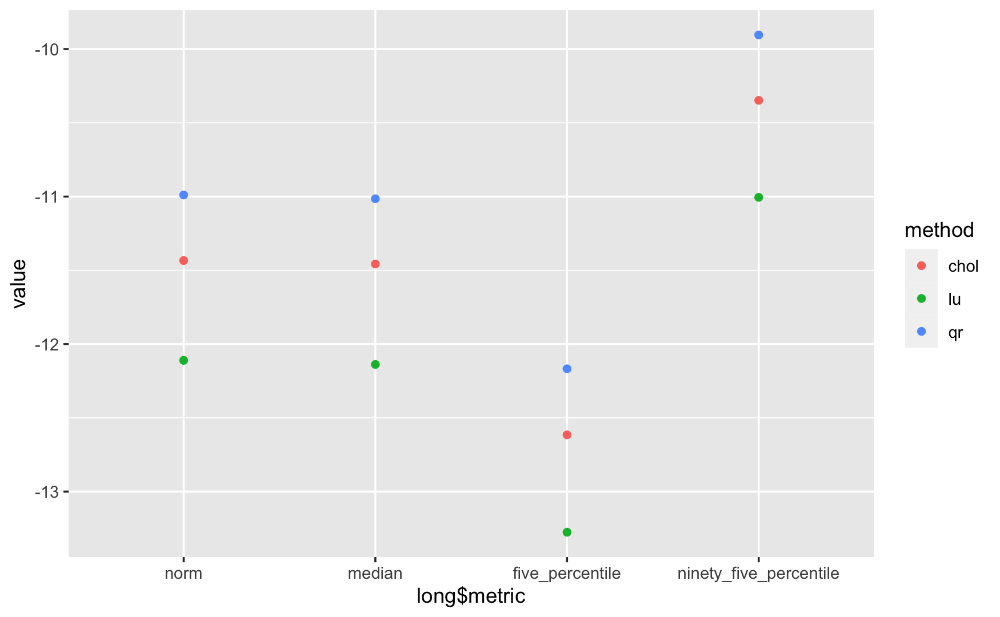
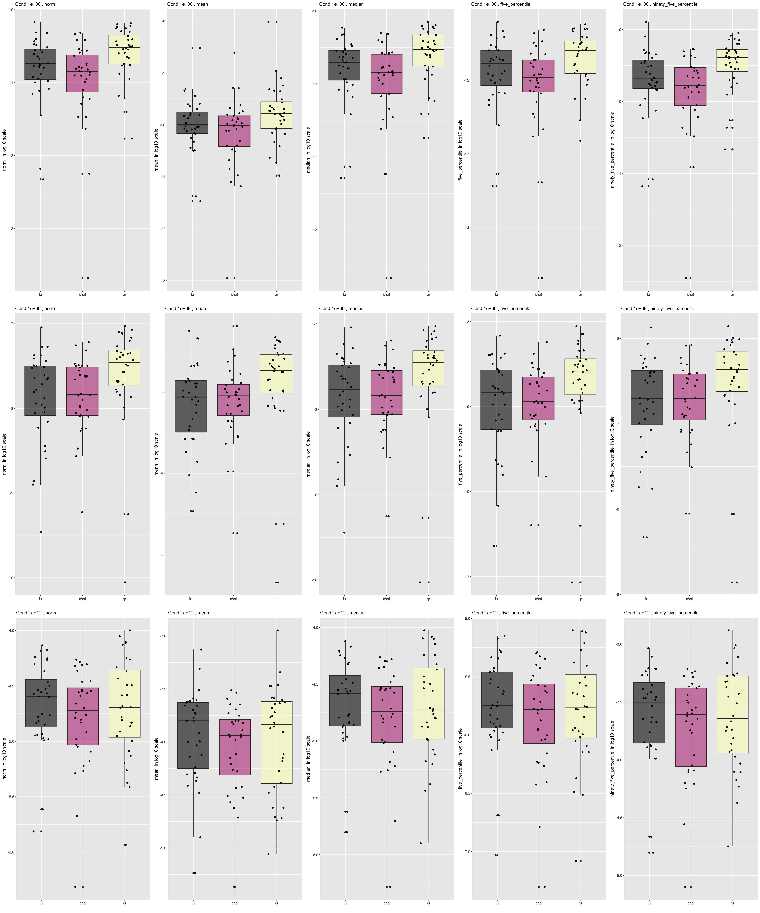

<script type="text/x-mathjax-config">
MathJax.Hub.Config({
  TeX: {
    Macros: {
      bA: "{\\boldsymbol{A}}",
      bx: "{\\boldsymbol{x}}",
      bb: "{\\boldsymbol{b}}"
    }
  }
});
</script>


```{r setup, include=FALSE}
source(file.path("..", "R", "util.R"))
library(Rcpp)
library(RcppEigen)
library(ggplot2)
library(data.table)
library(tidyverse)
library(hrbrthemes)
library(viridis)
required_packages <- c("microbenchmark")
install_and_load_packages(required_packages)
```


# Exercise 1: Comparing different numerical linear algebra algorithms for solving linear systems

In this exercise, we consider the problem of solving a linear system $\bA \bx = \bb$ for $\bx$.
We compare the three methods we learned in the class: LU, Cholesky, and QR decompositions.
(Of course, LU applies to more general systems and QR can be used to solve least squares, but here we focus on positive definite systems.)

## Part A: Racing for solution &mdash; speed comparison 

We first compare their computational speed. 
Fill in the code below and `bench::mark()` the three algorithms.

**Questions:**
What are relative speeds among the algorithms?
Do relative speeds agree with what you expect from the complexity analyses?
If not (quite), why might that be?


**Note:**
I misspoke about the R's built-in `chol()` function during the lecture:
when applied to a positive-definite `A`, the function actually returns an _upper-triangular_ matrix `R` such that `t(R) %*% R == A`.

```{r, eval=FALSE}
# Import the `rand_positive_def_matrix` function
source(file.path("R", "random_matrix.R"))

mat_size <- 1024L
A <- rand_positive_def_matrix(mat_size, cond_num = 1e3)
b <- rnorm(mat_size)

solve_via_cholesky <- function(A, b) {
  R <- chol(A)
  return (backsolve(R, forwardsolve(t(R), b)))
}

solve_via_qr <- function(A, b){
  qr <- qr_wrapper(A)
  return (solve(qr$R, t(qr$Q) %*% b))
}

are_all_close <- function(v, w, abs_tol = 1e-8, rel_tol = 1e-8) {
  abs_diff <- abs(v - w)
  are_all_within_atol <- all(abs_diff < abs_tol)
  are_all_within_rtol <- all(abs_diff < rel_tol * pmax(abs(v), abs(w)))
  return(are_all_within_atol && are_all_within_rtol)
}

sol <- solve(A,b)
sol_chol <- solve_via_cholesky(A,b)
sol_qr <- solve_via_qr(A,b)

are_all_close(sol, sol_chol)
are_all_close(sol, sol_qr)


bench::mark(
  solve(A, b)
)
bench::mark(
  solve_via_cholesky(A, b)
)
bench::mark(
  # Solve via QR decomposition
  solve_via_qr(A, b)
)

bench::mark(
  # Solve via QR decomposition
 qr.solve(A, b)
)


```

Solving by LU cost 133ms min, 134ms median; solving by Cholesky cost 176ms min, 177ms median; solving by self-implemented QR cost 1.32s min, 1.32s median, while soving by the r `qr.solve()` function cost 503ms min, 503 median. The relative speeds do not all agree with the complexity analyses. Theoreatically speaking, the complexity of LU is $\frac{2}{3} p^3$, Cholesky is $\frac{1}{3} p^3$ and QR is $2np^2 - \frac{2}{3}p^3$. Therefore, we expected QR to be the slowest, which agreed with our finding in the benchmark testing. However, we also found LU was faster than Cholesky. It could happen because I used a self-defined function and the machine needs to first allocate a memory space for the upper-triangular matrix R and then retrieve this matrix R for computation. As we can seen from the benchmark results, the memory allocated for Cholesky was 16MB, which was twice of that for LU. Therefore, this allocating-retrieving step in my cholesky function could cost extra time compared with the optimized R function `solve()`.

## Part B: Competition in terms of numerical accuracy/stability

We now compare the three methods in terms of numerical accuracy/stability.
To this end, we set up the following simulation study. 
We first generate a "ground truth" solution vector $\bx_0$.
We then compute an "numerical-error-free" $\bb = \bA \bx_0$ by carrying out the matrix-vector multiplication using the `long double` type, which (on most hardware and compilers) provides [additional 12 bits of precision](https://en.wikipedia.org/wiki/Extended_precision#x86_extended_precision_format).
Of course, the vector $\bb$ computed as such still suffers from numerical errors, but the idea is that the numerical errors from this high-precision matrix-vector multiplication is much smaller than the errors caused by numerically solving $\bA \bx = \bb$ for $\bx$.
We can thus assess the accuracy of the three solvers by comparing the numerically computed $\bx$ to the ground truth $\bx_0$.

### Task &#x2F00;

First compare the outputs of matrix-vector multiplication $\bx \to \bA \bx$ using `double` and `long double` using the provided Rcpp functions.

**Questions:**
What is the relative difference in $\ell^2$-norm? 
How about the coordinate-wise relative differences?
Are the observed magnitudes of the differences what you'd expect?


```{r, eval=FALSE}
Rcpp::sourceCpp(file.path("./src", "matvec_double.cpp"))
Rcpp::sourceCpp(file.path("./src", "matvec_ldouble.cpp"))

set.seed(1918)

mat_size <- 1024L
A <- rand_positive_def_matrix(mat_size, cond_num = 1e3)
x <- rnorm(mat_size)

ldouble <- matvec_ldouble(A,x)
double <- matvec_double(A,x)

metrics <- c("norm", "median", "five_percentile", "ninety_five_percentile")
lapply(metrics, function (metric) calc_rel_error(ldouble, double, metric))
```

**Answer:**
The relative difference in the $\ell^2$-norm is 1.185409e-15, and the coordinate-wise relative differences are 9.03173e-16 for median, 0 for 5% and 5.182136e-15 95%. The observed magnitudes of differences agreed with what I expected. The `long double` format is more precise, and provides additional 12 bits of precision, which gives approximately eighteen significant digits of precision (the floor of log10(2^63)). The difference between the `long double` and the `double` only affects the last 12 binary digits in the floating point and the maximum difference we'd expect from the the production of two elements is around $2^(-52) \approx 2e-16$. Therefore, the relative differences we observed for the matrix-vector multiplication are slightly higher than this number.

### Task &#x2F06;

Now randomly generate $\bA$ so that its condition number is $10^6$.
Then solve a positive-definite system $\bA \bx = \bb$ for $\bx$ using the three algorithms and compare their outputs to the ground truth $\bx_0$.

**Questions:**
Which algorithm appears to be more accurate than the others? 
Visually demonstrate your answer.

**Answer**
Solving via LU decomposition gives the highest accuracy.

```{r, eval=FALSE}
set.seed(1918)
cond_num <- 1e6

# Larger matrices could incur substantial computational time under base R BLAS
mat_size <- 1024L 

A <- rand_positive_def_matrix(mat_size, cond_num)
x <- rnorm(mat_size)
b <- matvec_ldouble(A,x)

x_solve <- solve(A,b)
x_solve_via_cholesky <- solve_via_cholesky(A,b)
x_solve_via_qr <- solve_via_qr(A,b)
x_qr_solve <- qr.solve(A,b)

x_approx <- list(lu = x_solve, chol = x_solve_via_cholesky, qr = x_qr_solve)
metrics <- c("norm", "median", "five_percentile", "ninety_five_percentile")

rel_error <- list()
methods <- c("lu", "chol", "qr")
for (method in methods) {
  rel_error[[method]] <- lapply(metrics, function (metric) calc_rel_error(x, x_approx[[method]], metric))
  }
# View(rel_error)
rel_error_df <- do.call(rbind.data.frame, rel_error)

colnames(rel_error_df) <- metrics

rel_error_df <- cbind(method = rownames(rel_error_df), rel_error_df)
rownames(rel_error_df) <- 1:nrow(rel_error_df)

long <- melt(setDT(rel_error_df), id.vars = c("method"), variable.name = "metric")
long$value <- log10(long$value)
ggplot(long, aes(x = long$metric, y = value, color = method)) +
  geom_point()

```
**Answer**
Based on the scatter plot, we observe the QR has the highest relative error based on the four metrics while LU has the smallest differences.
{width=100%}

### Task &#x4E09;

In Task &#x2F06;, we compared the three algorithms in one randomly generated example.
Now we consider a more systematic (though hardly comprehensive) comparison via repeated simulations.
We also vary the condition number of $\bA$ and assess whether the results would hold across varying degrees of ill-conditioning.

**Questions/To-do's:**

* Using the starter code provided, calculate various summary measures of the numerical errors.
* Integrate into the provided code one another (or more, if you like) meaningful metric(s) of your choice to summarize the numerical error.
* Visually explore how the three algorithms compare with each other in their accuracy. See if different error metrics tell different stories; they might or might not.
* Vary the condition number in the range $10^6 \sim 10^{12}$, e.g. by trying $10^6$, $10^9$, and $10^{12}$.
* Do you see any patterns in the numerical errors across the three algorithms, metrics, and/or condition numbers? Show some plots to support your conclusion.

**Answer**
{width=100%}
I added the mean as one of the coordinate-wise relative differences. Then I draw the boxplots for the different error metrics when varying the condition number by trying $10^6$, $10^9$, and $10^{12}$.
From the plots, I found that the numerical errors in the 5 selected metrics increased for all three algorithms as the increase of the condition number. When the condition number is $10^6$, Cholskey has the smallest relative errors while QR has the highest error across the five metrics. LU is close to the results of Cholskey but slightly worse. When the condition number is $10^9$, LU and Cholskey have similar accuracy while QR is still the worst. I also found that the metrics by LU have a higher variance (less precise than Cholskey). When the codition number is $10^12$ (a large conditionl number), the LU becomes the worst while Cholskey is still the best except for the 95 percentile.


**Note:** 
The QR solver will throw an error when the system is ill-condition enough that the numerical solution might not be very accurate. 
To force it to return the solution in any case, set `tol = .Machine$double.eps`.

```{r, fig.width=10, fig.height=10}
# Utility functions for bookkeeping simulation results.
source(file.path("R", "num_linalg_sim_study_helper.R"))

n_sim <- 32L
mat_size <- 512L
cond_num <- 1e6
metrics <- c("norm", "mean", "median", "five_percentile", "ninety_five_percentile")
  # TODO: add another metric and modify the helper script accordingly

# rel_error_list <- lapply(
#   c("lu", "chol", "qr"), 
#   function(method) pre_allocate_error_list(n_sim, metrics)
# )

rel_error_list <- list()
methods <- c("lu", "chol", "qr")
plot_list <- vector("list", length=12)
i = 1
for (cond_num in c(1e6,1e9,1e12)){
  for (sim_index in 1:n_sim) {
    A <- rand_positive_def_matrix(mat_size, cond_num)
    x <- rnorm(mat_size) 
    b <- matvec_ldouble(A, x)
    x_approx <- list( 
      lu = solve(A,b), chol = solve_via_cholesky(A,b), qr = qr.solve(A,b, tol = .Machine$double.eps)
    )
    for (method in methods) {
      rel_error <- lapply(
        metrics, 
        function (metric) calc_rel_error(x, x_approx[[method]], metric)
      )
      names(rel_error) <- metrics
      for (metric in names(rel_error)) {
        rel_error_list[[method]][[metric]][sim_index] <- rel_error[[metric]]
        }
    }
  }
  for (metric in metrics){
    df_sub <- cbind(rep(metric, n_sim),
                cbind(rel_error_list[["lu"]][[metric]], 
                      rel_error_list[["chol"]][[metric]], rel_error_list[["qr"]][[metric]]))
    colnames(df_sub) <- c("metric", methods)
    long_sub <- melt(setDT(as.data.frame(df_sub)), id.vars = c("metric"), variable.name = "method")
    long_sub$value <- log10(as.numeric(long_sub$value))
    
    plot_list[[i]] <- ggplot(data=long_sub,mapping = aes(x=method, y=value, fill=method)) +
      geom_boxplot()+
      geom_jitter(position=position_jitter(0.2)) +
      scale_fill_viridis(discrete = TRUE, alpha=0.6, option="A") +
      theme(legend.position="none",plot.title = element_text(size=11)) +
      ggtitle(paste("Cond",cond_num,",",metric)) +
      xlab("") + ylab(paste(metric," in log10 scale"))
    i = i + 1
  }
}

cowplot::plot_grid(plotlist = plot_list, nrow=3)

```
